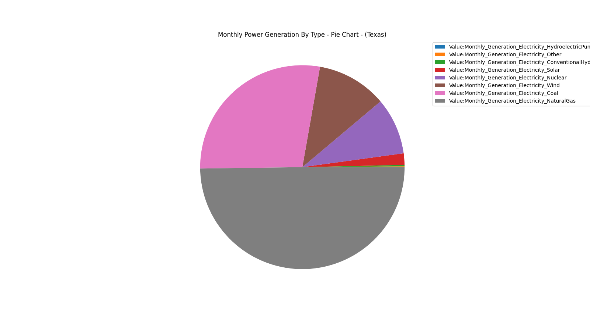
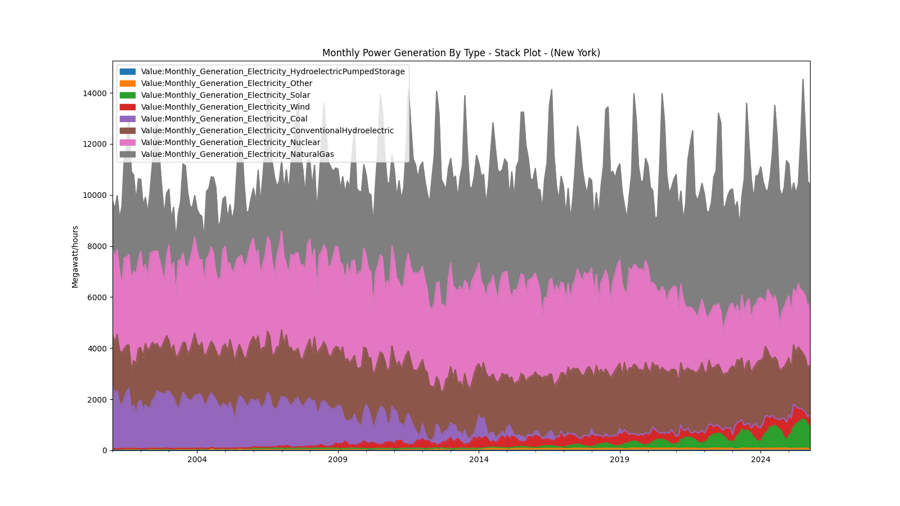
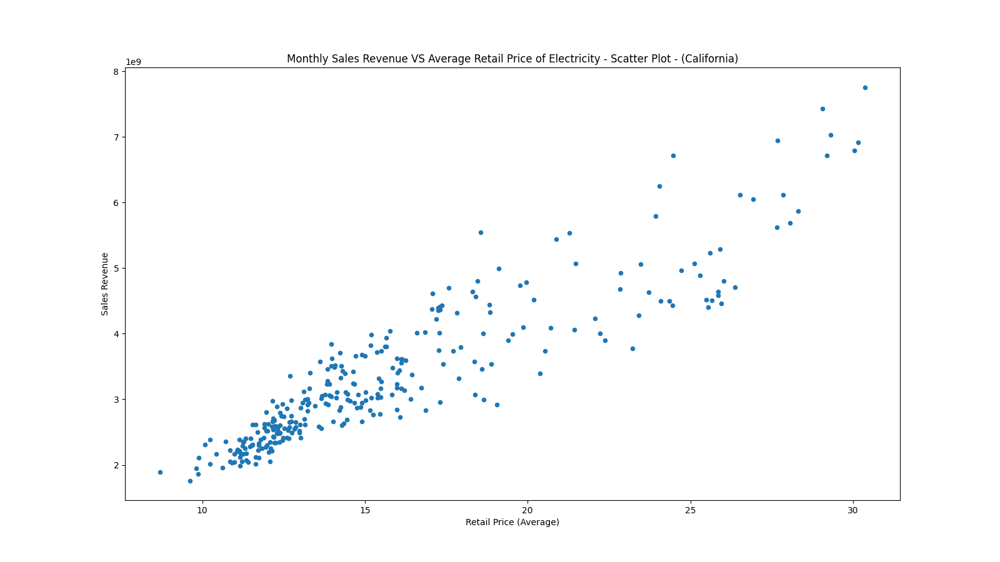

# data-utils

## Overview

A utility library for supporting data analysis tasks.

## Results

The following plots were created using data imported and
cleaned by this library:

Source: (https://www.eia.gov/opendata/browser/electricity) via
(https://www.datacommons.org/)

Source: (https://www.eia.gov/opendata/browser/electricity) via 
(https://www.datacommons.org/)

Source: (https://www.eia.gov/opendata/browser/electricity) via 
(https://www.datacommons.org/)

